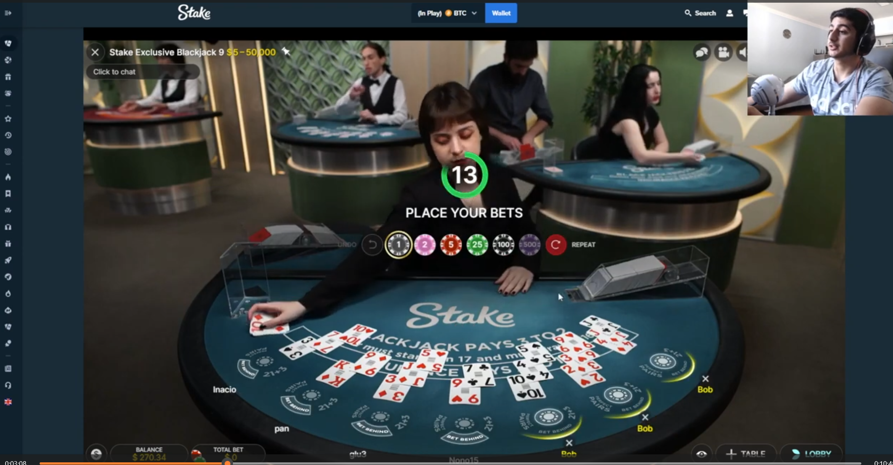
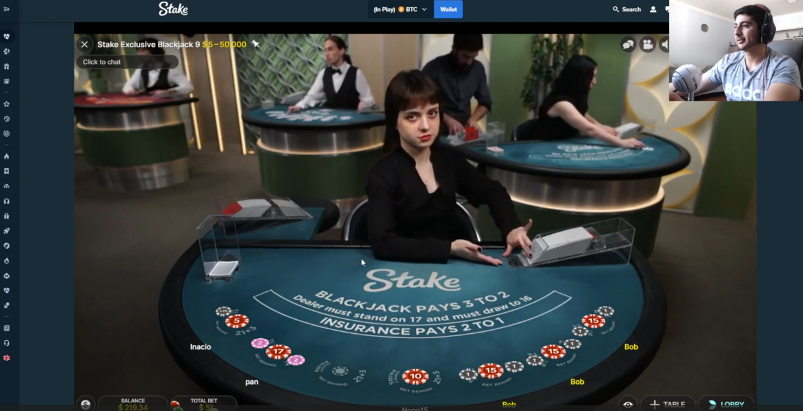
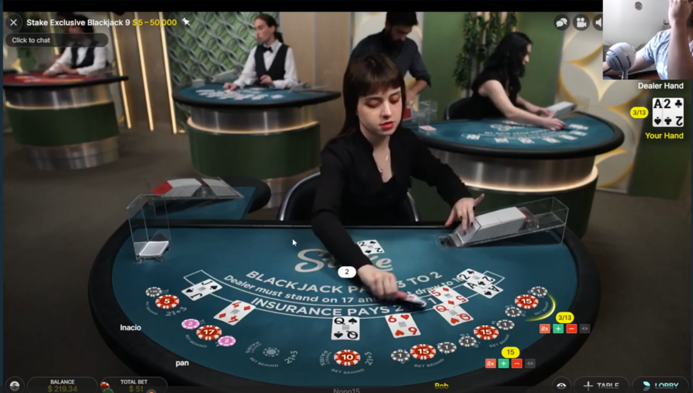
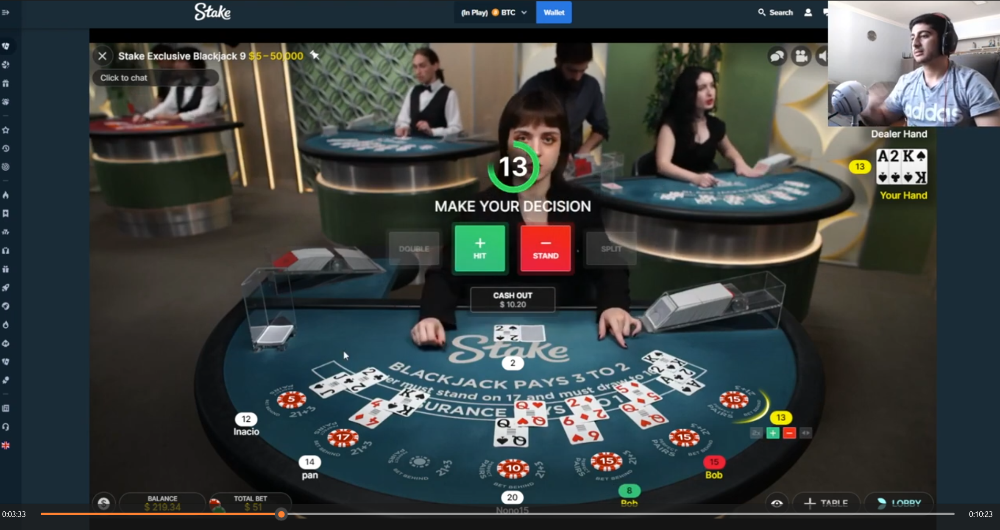
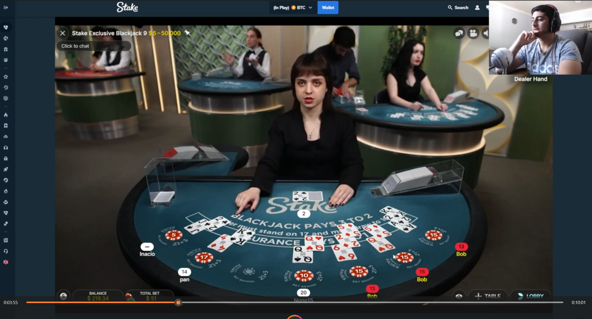
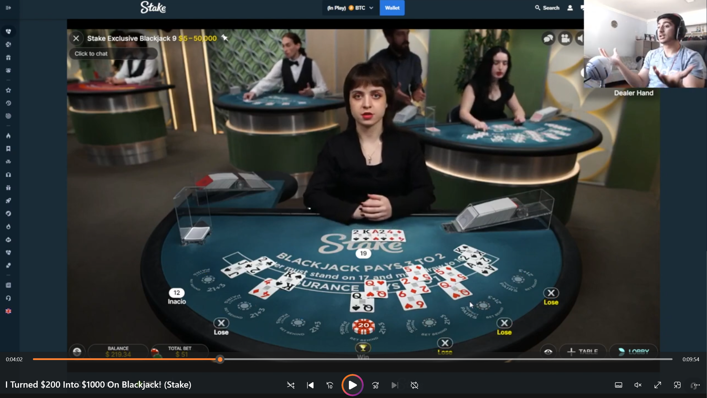

# Stake.com Blackjack flow

### Start of new game

When a new game starts, this 'place bets' overlay will show up

This means we should clear out everything and restart our tracking.

Wait for next step

### Start of new game with Players

The overlay will disapear which indicates that a new game is starting.

We should look at the chips spots to determine the ammount players that are in this active game.

Based on that, we should they give them their own bounding boxes for where cards should be.

### Count Initial Cards

While cards are being laid down, we should analzye what card it is for 3-5 seconds. Based on what shows up as the most predominate card, should be then selected and we should ignore all new input for the given area.

Stop acounting or changing things when 2 cards are detected in the player area. (maybe just overthinking it, but we can use the visual indicators on the webpage to detemeine if we should watch for another card to be added to a player's pile or not)

### Decision Making

When this overlay shows up, we need to then determine what our next step is, hold, double, split, or hit.

This could happen multiple times. Keep going thru the same loop till we bust or stand.

### Continue Counting

Refer the the Count Initial Cards step

### Dealer Reveal

Track what the final cards of the dealer are quickly and then game ends.

Loop back to the beginning
